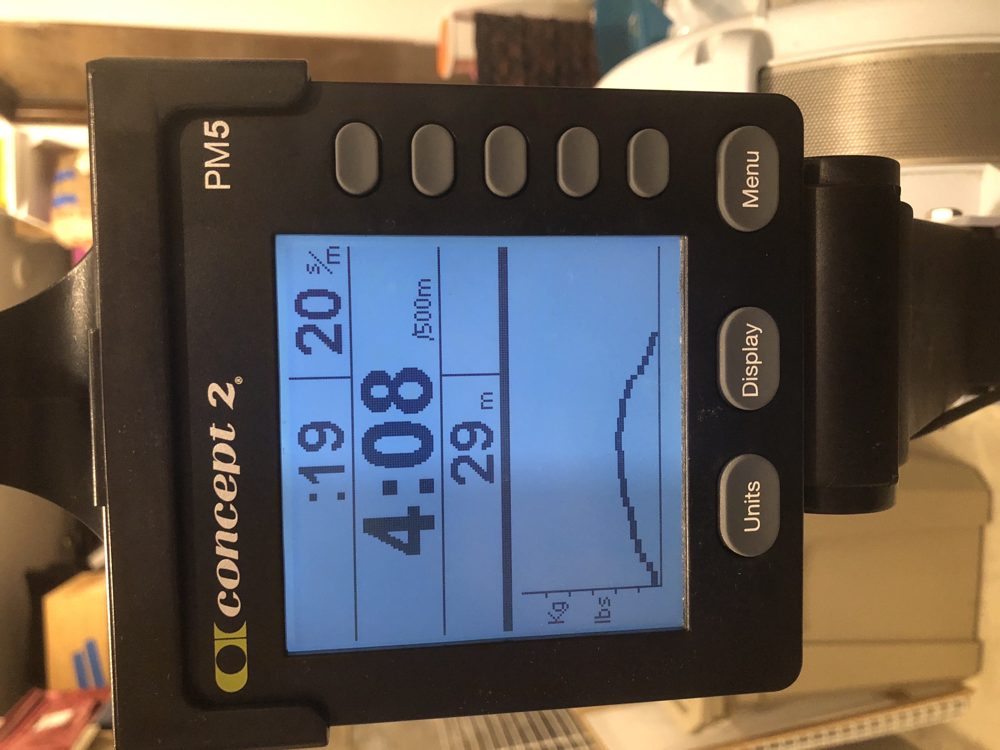
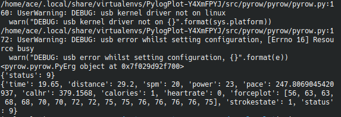

# Experiment 3
**Experiment Hypothesis:** The [py3row](https://github.com/droogmic/Py3Row) tool for getting data out of an erg is returning an empty list of ergs because it [only looks for USB devices](https://github.com/droogmic/Py3Row/blob/e1850c2060b2baff7608a3a38f516a72a472b6c2/pyrow/pyrow.py#L129-L142)

**Experiment:** Connect the erg to the computer using a USB A to B cable and see if it still returns an empty list

**Result:** Success! After [fixing a small permissions issue](https://stackoverflow.com/a/53134825) where pyusb was throwing the error `usb.core.USBError: [Errno 13] Access denied (insufficient permissions)`, it seems like I am now able to access basic information from the erg from python. Below are the photos comparing the data seen on the monitor and the basic data seen through Py3Row. 

