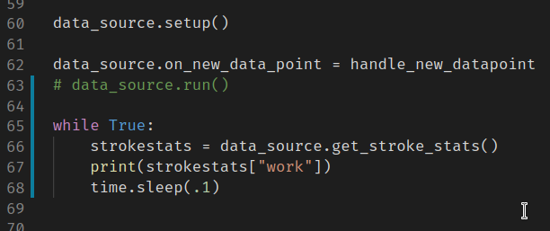

# Experiment 5
**Hypothesis:** Is it possible to log the "more advanced" stroke data (Stroke Distance, drive time, recovery time, stroke length, stroke count, Stroke peak force, Stroke Impulse Force, Stroke Average Force, Work per stroke) from the Py3Row library?

**Procedure:** Pretty similar to how basic dataloggign works with only slight differences in the commands send to the erg and the responses received

## Test A:
was able to get the "strokestats" data mentioned in the hypothesis from the erg after some additions to the Py3Row python package (located in my fork). Through printing this value every 1/10th of a second, I was also able to determine that the value only changed at the end of the drive of each stroke. This indicates that the "2 Hz (per stroke)" notation on Pg 12 of the Communication Interface Definition PDF (may be referred to as "the PDF" or CID throughout this site) should be interpereted as "this value is updated every stroke and 2Hz is somehow equivalent to that".

The following script was used in place of the regular `run()` call to confirm this update frequency:



Since all the values mentioned in the hypothesis are from the same command, they all (should) have the same update frequency, although as I only tested with the "Work per Stroke (J)" value, this may need further testing to establish whether or not any of the other values are updating at 2Hz rather than once per stroke as it may be the case that this is one value that happens to update once per stroke while the rest update more frequently.

**Data:**
Due to mistakes and the messy data generated from experimenting with trying to determine the update frequency (from before I just used the while loop above), this test doesn't really have any data.


## Test B

Did a 6k while logging the force values in addition to the values from the last experiment.

because I'm lazy and dont want to add headers to the first row of CSV data, here's the order of the comma separated values in each line:

`Overall Time, Overall Distance, Stroke Rate, Pace, Single Stroke Distance, Drive Time, recovery Time, Stroke Length, Stroke Count, Peak Stroke Force, Impulse Force, Average Stroke Force, Work, Force Curve datapoints`

*note* the Force curve datapoints are separated by `;` so as not to conflict with the commas separating the different pieces of data.

also, be sure to consult the units from the PDF as soe of these values are in terms of tenths or hundredths of the base unit.

Also, this is now enough information to use Concept2's formula (from the last experiment notes and the PDF) to calulate RPM.

If my math is correct, the spreadsheet grade formula for this should be:
```
=(E2/100)/(F2/100)*(60*12.93)/3
```
(in this formula E2 is single stroke distance, and F2 is the drive time)

However, *im not sure how accurate this is or if i did the math right*. Calculating the numbers from this piece shows values upwards of 3000 wheras the max values that the WPI paper measured were roughly 780.

**Raw Data:**
- [6k.csv](../files/experiments/5/6k.csv)

**Results/Conclusion:**
After messing with the data a bit (in [6k-headers.ods](../files/experiments/5/6k-headers.ods)) to determine the actual RPM values, I discovered  that there are two ways to calculate distance per time (i.e meters per second). One is using the stroke distance with the sum of thedrive and recovery times and the other is to just calculate it from the pace value (i.e. by dividing the seconds per 500 to get seconds per meter and then taking the inverse to get meters per second ). I found that in this 6k dataset, the percent error using the pace-calculated values as the "actuals" gave a Max, Average, and min of 77.56%, 21.65%, and 7.19% respectively.

These discoveries mean the initial formula was not quite correct, irrespective of the methodyou calculate meters per second, it seems like the formula is:
```
=([meters per second]*60*12.93)/3
```
These calculated RPM's had a Max, Avg, Min of about 1145.43, 1079.61, and 865.43. While the WPI paper's numbers of around 780-800 RPM seem close enough to confirm that this formula is at least in the ballpark, given the photos in the paper, it seems like Concept2 has made some revisions to the flywheel since the what looks like the model A-ish erg that WPI used in their paper.

**Graphs:**
TBD


**Future Improvements:**
- get a direct RPM measurement from the flywheel to double check these numbers
- investigate why the %error between the two methods of calculating meters/sec is so bad
- 
