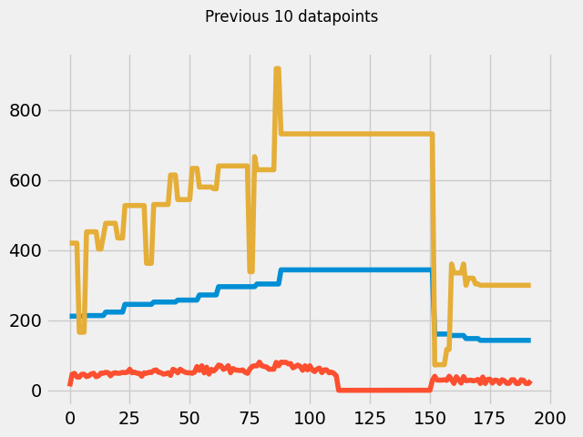

# Experiment 6
**Hypothesis:** How often can data (specifically distance and time as theyre needed to calculate RPM) be sampled from the erg?

## Procedure 1
made a [test script](https://github.com/MoralCode/ErgPlot/releases/tag/experiment6) and rowed a couple of strokes to ensure that most of the data had a chance to change at least once.

**Data:**
- [Print output for monotor data](../files/experiments/6/update_rate_monitordata.txt)
- - [Print output for stroke data](../files/experiments/6/update_rate_strokedata.txt)

**Analysis:**
Since the loop was checking for new data approximately every .01 seconds (10ms), and the results show at least one value updating roughly every 50ms, we know that this is not the bottleneck. Then by observing how frequently each of the values changes, its easy enough to tell how often they update.

## Procedure 2

Now that I know that most of the data inly updates roughly once a stroke (except for overall time and distance, which seemed to update every 50 ms or so), I began experimenting with ways to use this data to get an accurate meters per second count, which, using the formula from the last experiment analysis, could give a reading of RPM much more frequently.

Essentially the way this "differential method" works is by calculating and dividing the change in total distance from one data point to the next and dividing it by the change in time between those same datapoints, effectively allowing us to measure meters per secns, and thus RPM at something far better than once a stroke. 

all of this was done using versions of the [ErgPlot](https://github.com/MoralCode/ErgPlot/) code as tagged in releases/

*Note* Most of this is pretty much just testing and experimenting, especially at first to get things right

### Attempt 1:
dont think i saved the raw data for this as it was just testing to see what the RPM values looked like

### Attempt 2:

More of the same testing as last attempt, but switched to plotting meters per second. also added a legend for the graph

[graph data](../files/experiments/6/graph_3-data.py)

*Note* the data for this graph is formatted as a python list of dictionaries. Thats why it is in a .py file even though it is not directly runnable as python (because it isnt perfectly valid). Same goes for the rest of the attempts in this procedure.

This is where I started to realize that some math was being done wrong because one of the calculations looking somewhat correct (you can kinda see the little force-curve like patterns within the yellow line where i was taking each stroke) but still kinda high for the light paddling at like arms-only at best (which is how i was testing it). Meanwhile the other datapoints didnt seem to match.

Re-plotting this same data and converting to RPM (same data just shifted) shows that the RPM measurement is way off for all the lines, with the yellow reading way too high, and everything else just kinda sitting at the bottom

### Attempt 3:

After tweaking some of the formulas, the graphs now seem to mostly align, whith the two differentials being very similar (as expected since one uses the difference in time from python in milliseconds, the other uses the time difference from the erg).

[data](../files/experiments/6/graph4-data.py)

### Attempt 4:

With the values somewhat more in agrement with each other (or at the very least confirming that the differential method produces more datapoints than the other methods), I decided to experiment a little with this differential method by playing with the datapoints that were being used to calculate the differential.

By picking datapoints that arent directly consecutive, (say, datapoints 5 points apart) the differential becomes an average speed over those datapoints and can be used to plot a running average where each point is the average speed over the preceeding 5 datapoints. By varying this number, you can achieve different levels of smoothing the data out.

All lines in this plot were generated using [this data](../files/experiments/6/graph5-data.py), with no smoothing, and then skipping 2 points, 4 points, 8 points, and 16 points respectively (where skipping 2 points would, for a sample of 4 points A, B, C, D, would compute the difference in distance and time between points A and D).

**Future Improvements:**
- Still need to confirm this data by externally measuring RPM and comparing it to this value as calculated from concept2's own device.