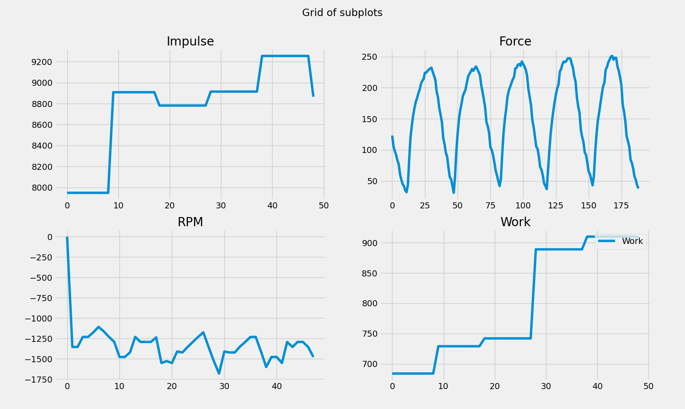

# Experiment 7
**Purpose of test:** To have data on a piece that includes most if not all the different pieces of data so far (particularly force curve, accurate distance and time for estimating RPM, and force/impulse data) 

## Procedure 
This experiment redid most of the [code](https://github.com/MoralCode/ErgPlot/releases/tag/experiment7) for logging from an erg so as to capture data in a while loop as often as possible and continually compare it to the last time the datapoint changed in any way so as to only save the changes to the data. This way it was possible to log the time and distance as often as they changed and use this to estimate RPM

**Data:**
- [CSV generated while testing the script](../files/experiments/7/testing123.csv) (this is probably useless but eh whatever)
- [warmup.csv](../files/experiments/7/warmup.csv) warmup pic-drill with roughly 20 strokes per position (arms, body, quarter-ish, half, threee-quarter, full-ish)
- [20k.csv](../files/experiments/7/20k.csv) the 20k piece with a sprint during the last < 20 strokes or so
  

  

**Analysis/Observations:**

- it seemed like - for some reason - the impule data this time around was a lot better and not dipping at the end of each stroke (not sure why it was doing that before) 
- RPM data seemed to be plotted negative on the graph when the liveplot was running. not sure if this is a bug in the liveplot or the data collection

Also, here is Ben's Graphs with one overlaying RPM on each stroke and the othershowing the average RPM per stroke with 1 standard deviation marked.

**Future Improvements:**

Seems like RPM data is still very rough and not available too freuently. maybe it can be collected directly from what i presume are pulses on each rotation coming from the flywheel cable?