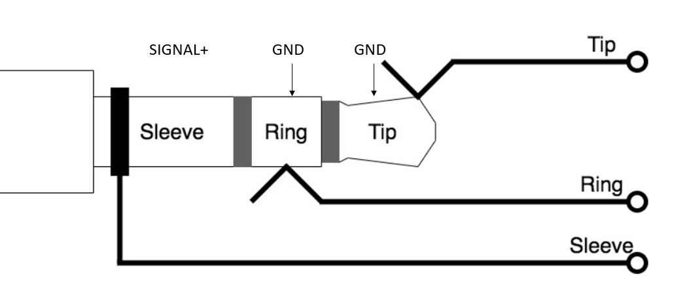
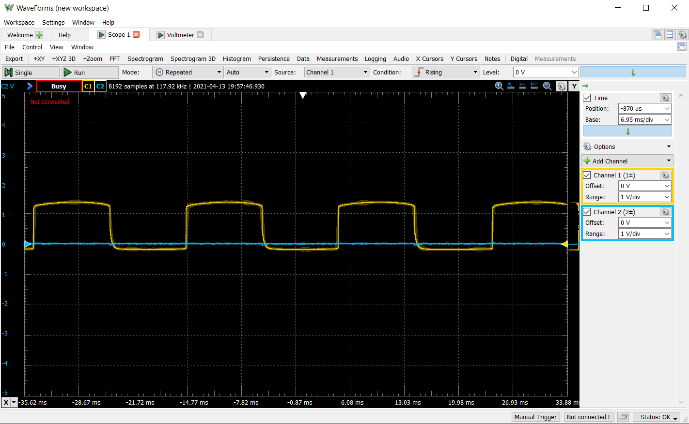
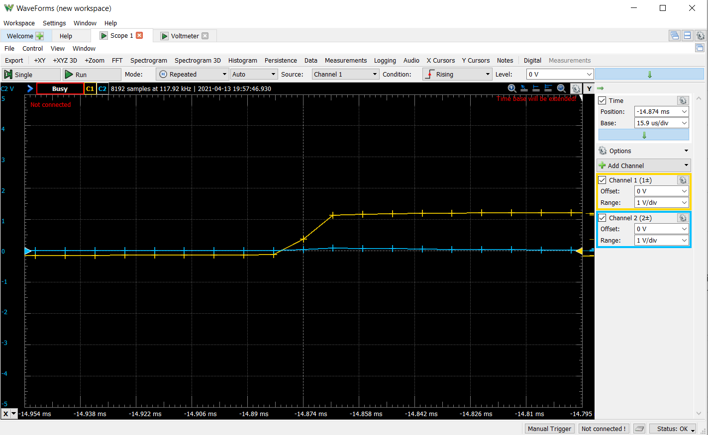

# Experiment 8

## Hypothesis 
In setting up this experiment, the goal was to understand and characterize the waveform that the PM5 receives from the erg fan via a 2.5mm jack. Due to the nature of the erg, the waveform produced is expected to be periodic with the rotation of the erg fan, but the shape is unknown (sinusoidal, square, etc.).

## Procedure 
The jack was removed from the PM5 leads from a digital oscilloscope were hooked to the leads on the jack until a configuration was found that produces a periodic function. This configuration is diagrammed below.

Though this worked for this experiment, if the signal was to be passed on to the PM5 to correlate this data to a piece, this setup would need to be altered to preserve the signal.
Data:

Using this setup, the resulting waveform is shown below.

Rising Edge Close-up

    
## Analysis:

The result produced is indeed a square waveform, resting at just below 0V and high at 1.1V. The scope was let to run while the erg fan gradually came to a stop, and the waveform decreased in frequency proportional to RPM, or at least the sounds that would correlate to RPM of the erg fan. At lower RPMs however, the rising and falling edges of the square wave are more gradual, but this bound is far below any reasonable operating condition. In the picture shown, the period is 9.76ms, or a frequency of 102.5 Hz.
The rising edge shown happens over 16 microseconds, which may or may not be fast enough for a rising edge trigger to detect the state change.

## Future Improvements:

This experiment was very successful in shedding light on the waveform that can be sniffed from the erg into the PM5. The next goal from this experiment is creating an arduino/microcontroller setup to count pulses and log the frequency. We also need to figure out specifically how these pulses relate to RPM, as there are likely multiple pulses per revolution. From there the goal would be creating a setup that logs the pulse frequency as well as sends the signal to the PM5 so this data can be correlated with a piece. 
